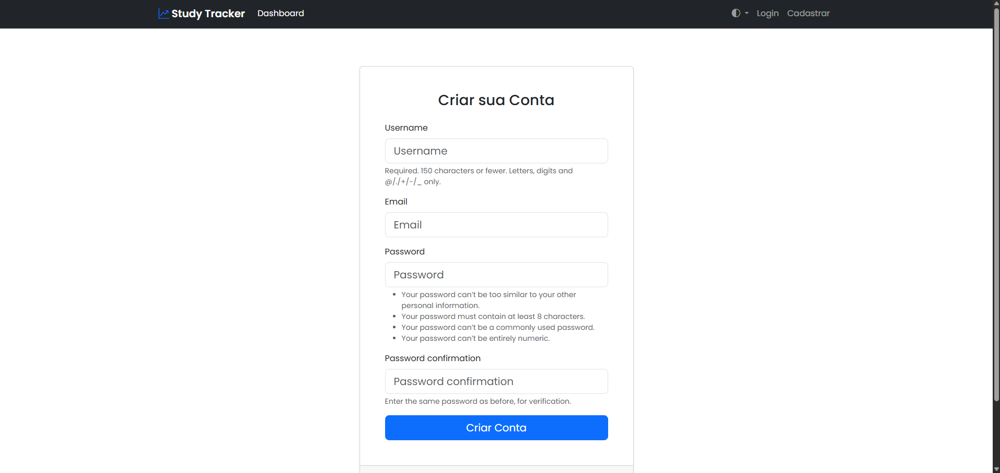
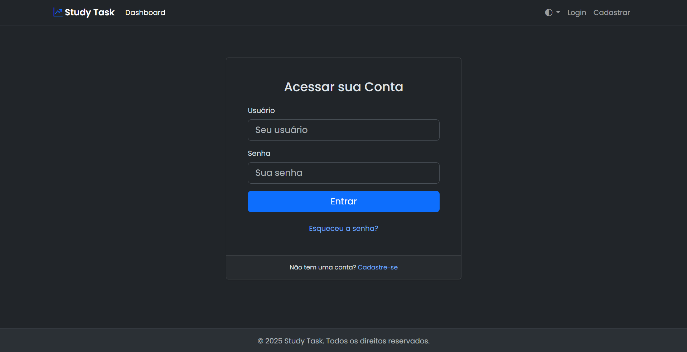
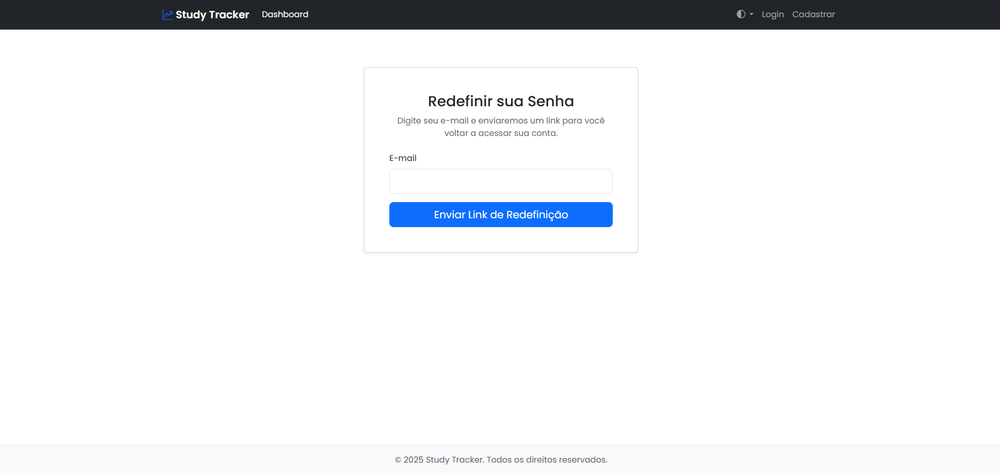
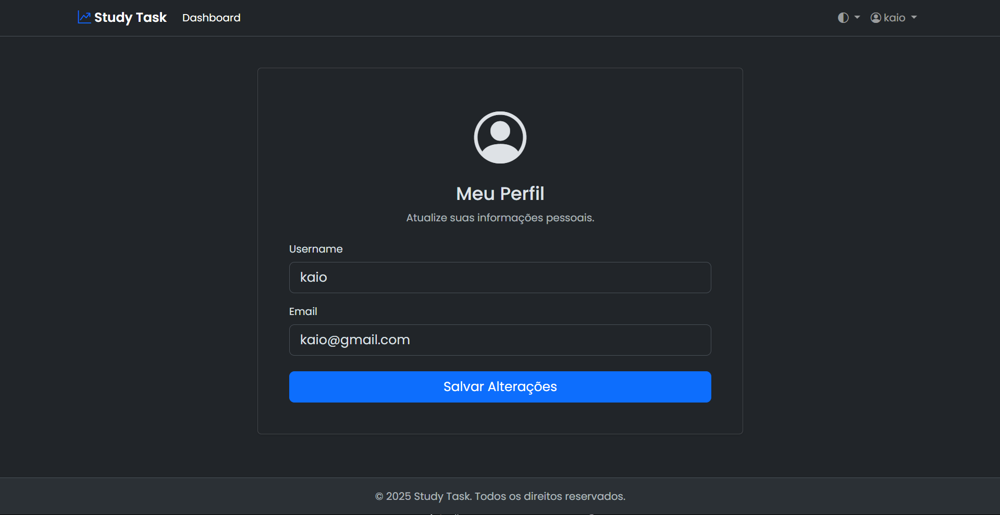
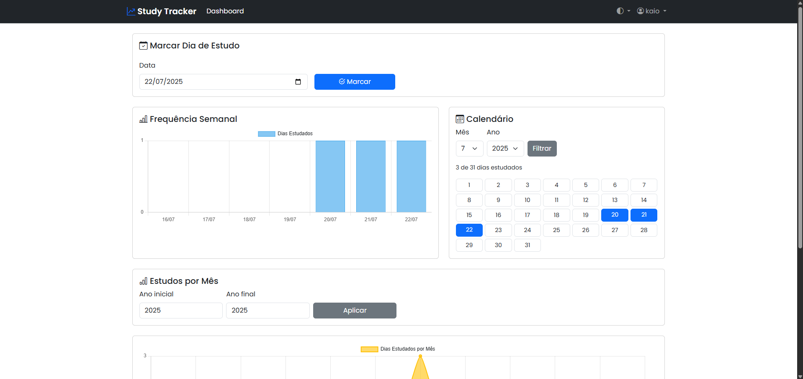
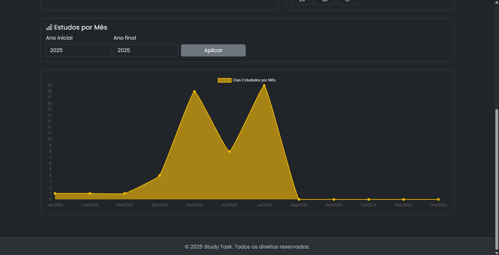

#  Tracker de Estudos (Study Tracker)


Uma aplicação web construída com Django para acompanhar e visualizar seus hábitos de estudo diários, ajudando a manter a consistência e a motivação.
## Cadastre-se

## Login

## Redefinir Senha

## Perfil

## Dashboard



## ✨ Funcionalidades Principais

-   **Autenticação de Usuário Completa:** Cadastro, Login, Logout, "Esqueci minha Senha" e Perfil de Usuário.
-   **Dashboard Interativo:** Visualize seus dados de estudo de forma clara e objetiva.
-   **Gráfico de Frequência Semanal:** Um gráfico de barras mostrando sua atividade nos últimos 7 dias.
-   **Gráfico de Tendência Mensal:** Um gráfico de linhas para ver seu progresso ao longo dos meses e anos.
-   **Calendário Visual:** Visualize de forma clara os dias estudados em cada mês.
-   **Seletor de Tema:** Alterne entre os modos Claro (Light) e Escuro (Dark) com persistência da sua escolha.
-   **Design Responsivo:** Interface totalmente funcional em desktops e dispositivos móveis.

## 🛠️ Tecnologias Utilizadas

-   **Backend:** Python, Django
-   **Frontend:** HTML, CSS, JavaScript, Bootstrap 5, Chart.js
-   **Banco de Dados (Dev):** SQLite3

## 🚀 Instalação e Execução

Siga os passos abaixo para rodar o projeto localmente.

### Pré-requisitos
-   Python 3.8+
-   Git

### 1. Clone o Repositório
```bash
git clone [https://github.com/seu-usuario/seu-repositorio.git](https://github.com/seu-usuario/seu-repositorio.git)
cd seu-repositorio
```

### 2. Crie e Ative um Ambiente Virtual
```bash
# Windows
python -m venv venv
.\venv\Scripts\activate

# macOS / Linux
python3 -m venv venv
source venv/bin/activate
```

### 3. Instale as Dependências
Crie um arquivo `requirements.txt` na raiz do projeto com o seguinte conteúdo:
```txt
Django
python-dateutil
```
E então instale as dependências:
```bash
pip install -r requirements.txt
```

### 4. Aplique as Migrações do Banco de Dados
```bash
python manage.py migrate
```

### 5. Crie um Superusuário (Administrador)
```bash
python manage.py createsuperuser
```
Siga as instruções para criar seu usuário administrador.

### 6. Rode o Servidor de Desenvolvimento
```bash
python manage.py runserver
```
A aplicação estará disponível em `http://127.0.0.1:8000`.

## 📖 Uso

-   Acesse a página e crie uma nova conta através da opção "Cadastrar".
-   Faça login para acessar seu Dashboard.
-   Use os filtros do calendário e dos gráficos para visualizar seu progresso.
-   Alterne entre os temas claro e escuro usando o seletor na barra de navegação.
