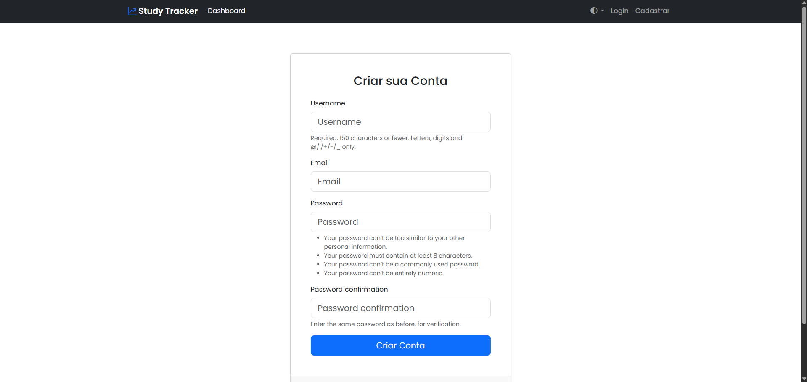
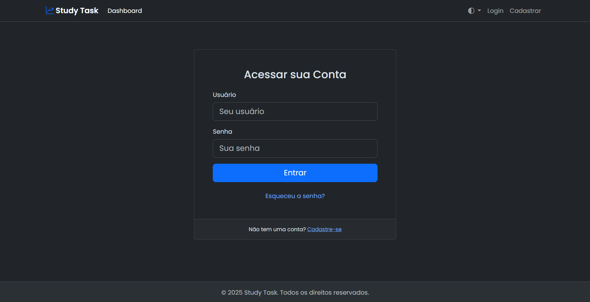
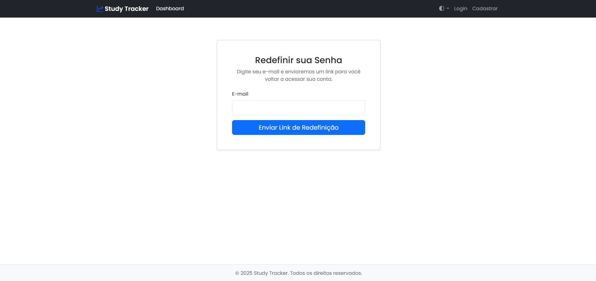
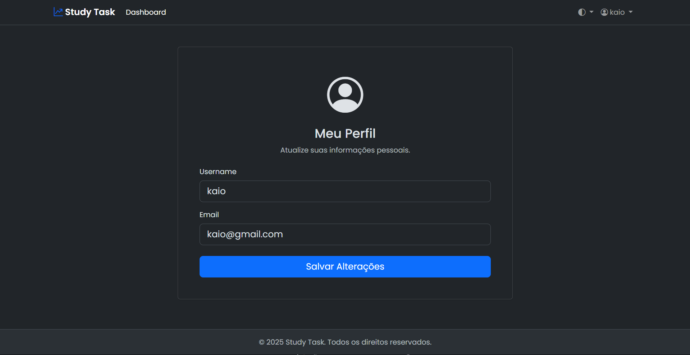
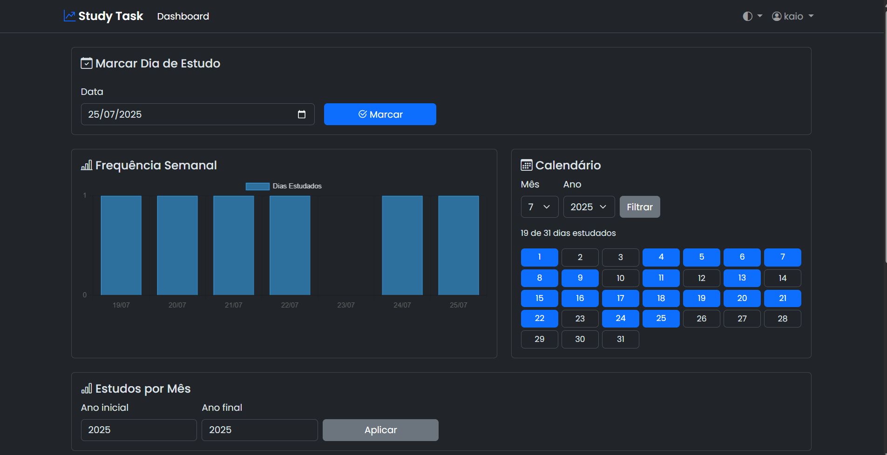
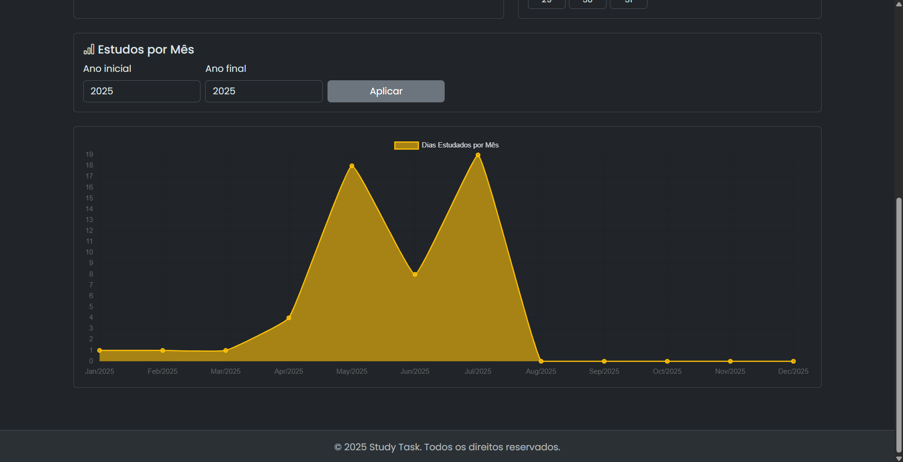

#  Tarefas Diárias (Study Task)


Uma aplicação web construída com Django para acompanhar e visualizar seus hábitos de estudo diários, ajudando a manter a consistência e a motivação.
## Cadastre-se

## Login

## Redefinir Senha
> Agora você pode redefinir sua senha via e-mail! Basta clicar em "Esqueci minha senha", inserir o e-mail de cadastro e seguir as instruções recebidas na sua caixa de entrada.

## Perfil

## Dashboard



## ✨ Funcionalidades Principais

- **Autenticação de Usuário Completa:** Cadastro, Login, Logout, "Esqueci minha Senha" (com envio por e-mail) e Perfil de Usuário.
- **Dashboard Interativo:** Visualize seus dados de estudo de forma clara e objetiva.
- **Gráfico de Frequência Semanal:** Mostra a atividade nos últimos 7 dias.
- **Gráfico de Tendência Mensal:** Acompanha o progresso ao longo dos meses e anos.
- **Calendário Visual:** Dias estudados destacados mês a mês.
- **Seletor de Tema:** Alterna entre temas claro e escuro, com persistência.
- **Design Responsivo:** Totalmente adaptável para desktop e mobile.

---

## 🛠️ Tecnologias Utilizadas

- **Backend:** Python, Django
- **Frontend:** HTML, CSS, JavaScript, Bootstrap 5, Chart.js
- **Banco de Dados (Dev):** SQLite3
- **Deploy Containerizado:** Docker, Docker Compose, PostgreSQL

---

## 🚀 Instalação e Execução

### 🧪 Localmente (Ambiente Virtual)

#### 1. Clone o Repositório

```bash
git clone https://github.com/KaioHerculano/daily_task
cd daily_task
```

#### 2. Crie e Ative um Ambiente Virtual

```bash
# Windows
python -m venv venv
.\env\Scripts\ctivate

# macOS / Linux
python3 -m venv venv
source venv/bin/activate
```

#### 3. Instale as Dependências

```bash
pip install -r requirements.txt
```

#### 4. Aplique as Migrações e Crie um Superusuário

```bash
python manage.py migrate
python manage.py createsuperuser
```

---

### ⚙️ Executando com Docker

#### 1. Configure o arquivo `.env`

Crie um arquivo `.env` na raiz do projeto com o seguinte conteúdo:

```env
SECRET_KEY="sua-secret-key-super-segura-aqui"
DEBUG=True
ALLOWED_HOSTS=localhost,127.0.0.1

POSTGRES_DB=daily_db
POSTGRES_USER=usuario_db
POSTGRES_PASSWORD=senha_forte_db
POSTGRES_HOST=db
POSTGRES_PORT=5432
DATABASE_URL=
PORT=8000

EMAIL_HOST_USER=seu-email@gmail.com
GMAIL_APP_PASSWORD=sua-senha-de-app-de-16-digitos
```

> Obs: Para o reset de senha funcionar, é necessário configurar o `EMAIL_HOST_USER` (seu e-mail) e o `GMAIL_APP_PASSWORD` (senha de app gerada no Gmail).

#### 2. Execute com Docker Compose

```bash
docker-compose up --build
```

#### 3. Acesse a aplicação

Abra no navegador:

```
http://localhost:8000
```

---

## 👀 Em Breve

- Notificações por e-mail
- Exportar relatórios em PDF

---

## 📅 Status do Projeto

> Em desenvolvimento ativo. Contribuições são bem-vindas!
